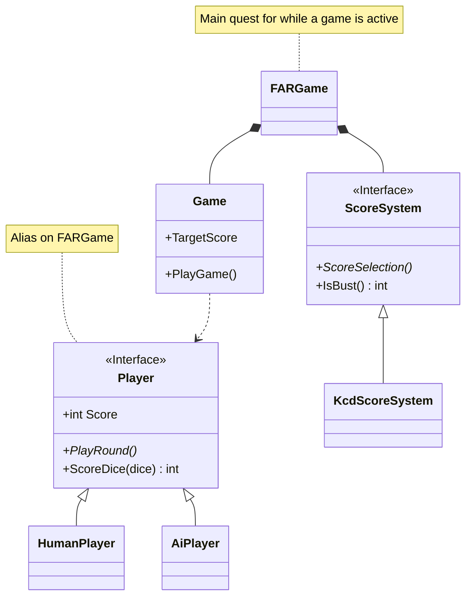

# Farkle

Implementation of Farkle in Skyrim, using Kingdom Come Deliverance rules

## Covered Areas

This is primarily a Papyrus project, but also has elements of quest and asset implementation.
A game of Farkle is controlled via a quest which is started using the story manager system.

## Implementation

