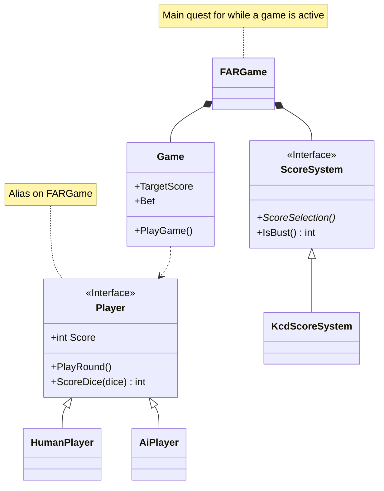

# Farkle

- [Farkle](#farkle)
  - [How to Play](#how-to-play)
    - [Scoring](#scoring)
  - [Covered Areas](#covered-areas)
  - [Table Locations](#table-locations)
  - [Adding New Tables](#adding-new-tables)
  - [Game Implementation](#game-implementation)
    - [AI Behavior](#ai-behavior)
    - [Edge Cases](#edge-cases)
  - [Dialogue Generation](#dialogue-generation)
- [Credits](#credits)


Fancy a round of dice? Implementation of Farkle in Skyrim, using Kingdom Come
Deliverance rules

[](https://youtu.be/ncjWSoXkY9E)

## How to Play

At the beginning of a round, players throw all six dice at once.
After each throw, you must set aside and score one or more die, then bank or throw the remaining dice.
If you score all six dice in a round, you may rethrow all six again.
If you are unable to score from a throw, you are bust and lose all unbanked points.
The game continues until either player reaches the target score.

### Scoring

One - 100 points.
Five - 50 points.
Three ones - 1000 points.
Three of a kind - 100 * face value.
Four of a kind - Double of three of a kind.
Five of a kind - Four times of three of a kind.
Six of a kind - Eight times of three of a kind.
Run of 1 to 5 - 500 points.
Run of 2 to 6 - 750 points.
Run of 1 to 6 - 1500 points.

## Covered Areas

This is primarily a Papyrus project, but also has elements of quest and asset implementation.
A game of Farkle is controlled via a quest which is started using the story manager system.

## Table Locations

- Bannered Mare
- Bee and Barb
- Drunken Huntsman
- New Gnisis Cornerclub
- Ragged Flagon
- Retching Netch
- Winking Skeever

## Adding New Tables

Place a `FARTable` and link two chairs to it (Chair -> `FARTable`), these will be used by the players when a game is active.
To clear the table before a game starts, place an `XMarker` as an enable parent for the clutter to disable,
and link `FARTable` to the marker (`FARTable` -> `XMarker`).

A table can have more than two chairs linked to it, so long as exactly two are enabled at any given time. This is the case for
the table in the Ragged Flagon where chairs change variants depending on quest progress.

## Game Implementation



### AI Behavior

An AI player will follows the following strategy each roll, and will
always either:
1. Score as few dice as possible, preferring combinations that give more points
   if they use an equal number of dice.
2. Score everything it can

The "take everything" behavior is triggered when one of the following conditions
is met:
1. Doing so would win the game for the AI
2. A "full house" using all rolled dice is available
3. The AI does not plan to reroll
3. Randomly, weighted towards higher chances based on the value of taking all.

The AI considers whether to reroll as follows:
1. Never reroll if we have already won
2. Randomly, less likely based on risk of going bust if they take everything
   beforehand multiplied based on current unbanked score.

### Edge Cases

1. The player's first roll of the game is guaranteed to never bust. If this
   would happen, it will be silently rerolled.
2. An AI is forbidden from winning a game before the player has rolled. If this
   would happen, the AI's roll will be replaced with a bust.

## Dialogue Generation

Dialogue is generated using xVASynth. Starting with the creation kit's dialogue
export, run the below query using the Rainbow CSV extension for VSCode

```
select "skyrim" as game_id, "sk_" + a['VOICE TYPE'].toLowerCase() as voice_id,
a['RESPONSE TEXT'] as text, a['FULL PATH'].replace('.xwm', '.wav') as out_path
```

# Credits

Dice textures sourced from
[Dice Bag](https://www.nexusmods.com/skyrimspecialedition/mods/90972) by
MerryMalfunctioning, using textures by Kanjs and meshes by