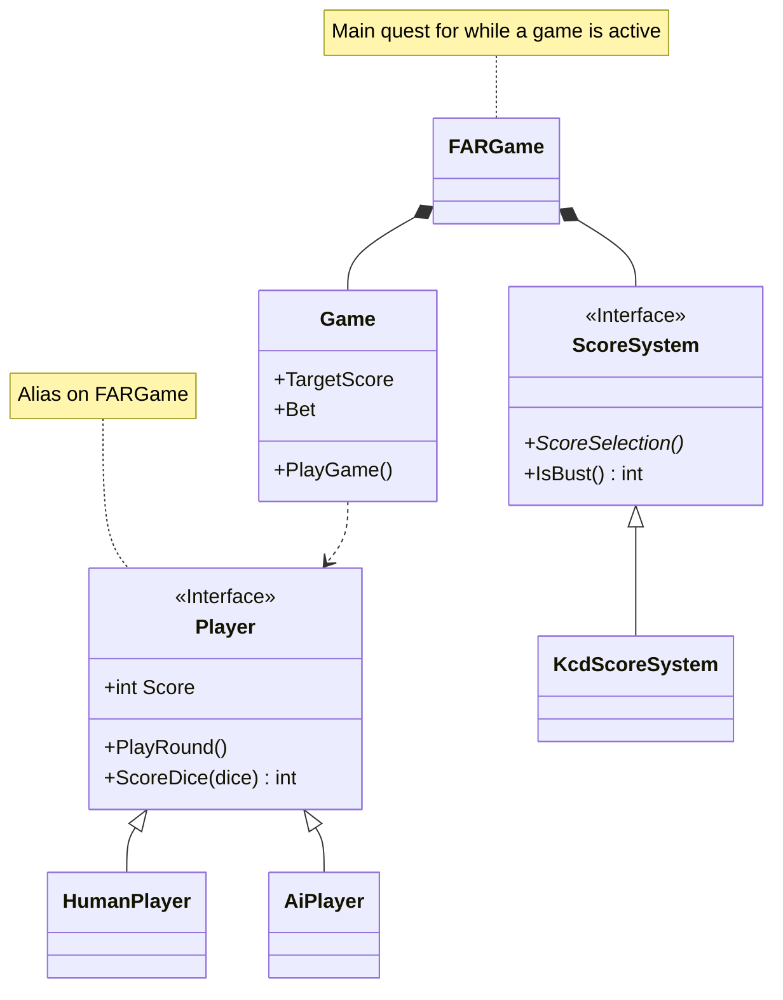

# Farkle

Implementation of Farkle in Skyrim, using Kingdom Come Deliverance rules

## Covered Areas

This is primarily a Papyrus project, but also has elements of quest and asset implementation.
A game of Farkle is controlled via a quest which is started using the story manager system.

## Table Locations

- Bannered Mare
- Bee and Barb
- Drunken Huntsman
- New Gnisis Cornerclub
- Ragged Flagon
- Retching Netch
- Winking Skeever

## Adding New Tables

Place a `FARTable` and link two chairs to it (Chair -> `FARTable`), these will be used by the players when a game is active.
To clear the table before a game starts, place an `XMarker` as an enable parent for the clutter to disable,
and link `FARTable` to the marker (`FARTable` -> `XMarker`).

A table can have more than two chairs linked to it, so long as exactly two are enabled at any given time. This is the case for
the table in the Ragged Flagon where chairs change variants depending on quest progress.

## Game Implementation

### AI Behavior

An AI player will follows the following strategy each roll, and will
always either:
1. Score as few dice as possible, preferring combinations that give more points if they use
   an equal number of dice.
2. Score everything it can

The "take everything" behavior is triggered when one of the following conditions is met:
1. Doing so would win the game for the AI
2. A "full house" using all rolled dice is available
3. The AI does not plan to reroll
3. Randomly, weighted towards higher chances based on the value of taking all.

The AI considers whether to reroll as follows:
1. Never reroll if we have already won
2. Randomly, less likely based on risk of going bust if they take everything beforehand
   multiplied based on current unbanked score.